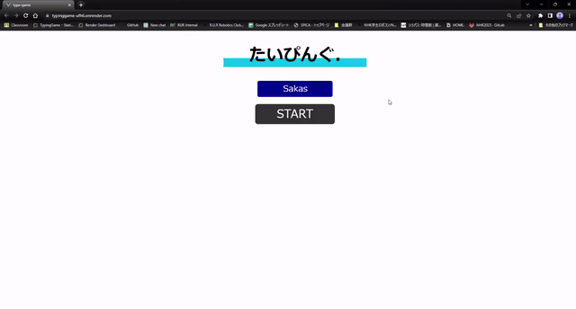

# Typing Game

Vue 3 のフロントエンドと Rust/Actix Web のバックエンドで作成した、タイム計測・効果音・ランキング機能付きのタイピングゲームです。

- GitHub: https://github.com/Mr-Sakasu/typing-game
- 公開URL: https://typinggame-ufh6.onrender.com/
- 種別: フルスタック Web アプリ、タイピングゲーム、ランキングシステム

<p align="center">
  
</p>

## デモ動画 / Demo Video

<p align="center">
  
</p>

## 現在の公開状態

現在の公開版ではバックエンドを停止しているため、ランキングの保存・取得は行わず、ランキングは表示されない運用にしています。タイピングゲーム本体はフロントエンドだけで動作します。

## 作成物の説明

ランダムに出題される単語を入力し、全問クリアまでの時間を競う Web アプリです。ゲーム本体は Vue 3 で実装し、スコア保存・順位計算・ランキング取得は Rust/Actix Web と PostgreSQL で扱う設計にしています。

## 機能と実装スタック

- タイピング進行: Vue 3 のコンポーネント state、`v-model`、`watch` を使い、入力文字列と現在の問題文をリアルタイムに照合します。正解したら次の問題へ進み、指定問数を終えるとクリア状態に遷移します。
- 出題管理: JavaScript の配列操作で問題リストからランダムに単語を取り出し、同じプレイ中に同じ問題が出にくいようにしています。
- タイム計測: JavaScript の `Date` と `setInterval` で開始からの経過時間を計測し、クリア時の秒数をスコアとして扱います。
- 進捗表示: Vue の computed property で進捗率を計算し、ゲージの幅と色に反映します。プレイヤーが残り問題数を直感的に把握できるようにしています。
- 入力フィードバック: MP3 音声ファイルを `Audio` API で再生し、通常入力、ミスタイプ、正解を音で区別しています。
- ランキング設計: フロントエンドは `axios` で API に接続し、バックエンドは Rust/Actix Web で `POST /users`、`GET /score_rank/{score}`、`GET /ranking/{rank_num}` を提供します。データ永続化は PostgreSQL、SQL 実行は `sqlx` が担当します。
- デプロイ構成: Render.com を想定し、フロントエンドの接続先は `VUE_APP_BACKEND_URL`、バックエンドの DB 接続は `RENDER_POSTGRES_INTERNAL_DBURL`、CORS 許可元は `FRONTEND_URL` で切り替えます。

## 担当した役割

- Vue 3 によるゲーム画面、入力判定、タイマー、進捗ゲージ、効果音の実装
- `axios` を使ったフロントエンドとバックエンド API の連携
- Rust/Actix Web による REST API と CORS 設定の実装
- PostgreSQL と `sqlx` を使ったスコア保存、順位計算、ランキング取得の実装
- Render.com 上でフロントエンド、バックエンド、PostgreSQL を分けて動かす構成の整理

## 直面した課題と解決方法

- フロントエンドだけでゲームを完結させつつ、ランキングはバックエンドに分離する必要がありました。ゲーム進行は Vue のローカル state に閉じ、スコア登録とランキング取得だけを API に切り出しました。
- フロントエンドとバックエンドを別オリジンで動かすため、`FRONTEND_URL` によって CORS の許可元を切り替えられるようにしました。
- デプロイ環境ごとに URL や DB 接続情報が変わるため、接続先を環境変数に分離しました。
- 現在はバックエンド停止中でも公開ページを見られるように、ランキング機能に依存せずタイピング本体を動かせる構成にしています。

## 技術情報

- Frontend: JavaScript, Vue.js 3, Vue CLI, axios, MP3 audio assets
- Backend: Rust, Actix Web, actix-cors, serde, serde_json, sqlx
- Database: PostgreSQL
- Deployment: Render.com

## API

- `POST /users`: ユーザー名、スコア、作成日時を保存
- `GET /score_rank/{score}`: 指定スコアの順位を取得
- `GET /ranking/{rank_num}`: 上位ランキングを取得
- `POST /create`: `users` テーブルを作成
- `POST /delete`: `users` テーブルを削除

## 環境変数

Frontend:

```bash
VUE_APP_BACKEND_URL=http://localhost:8000
```

Backend:

```bash
RENDER_POSTGRES_INTERNAL_DBURL=postgres://...
FRONTEND_URL=http://localhost:8080
PORT=8000
```

## Commands

Frontend:

```bash
cd frontend
npm install
npm run serve
npm run build
```

Backend:

```bash
cd backend
cargo run
```

## 関連リポジトリ

- Portfolio: https://github.com/Mr-Sakasu/portfolio
- 競技プログラミング: https://github.com/Mr-Sakasu/abc
- Virtual Contest Bot: https://github.com/Mr-Sakasu/virtual-contest-bot

---

# English

Typing Game is a web typing game built with a Vue 3 frontend and a Rust/Actix Web backend. It includes time tracking, input feedback sounds, progress display, and a ranking system design backed by PostgreSQL.

- GitHub: https://github.com/Mr-Sakasu/typing-game
- Live URL: https://typinggame-ufh6.onrender.com/
- Type: full-stack web app, typing game, ranking system

## Current Deployment Status

The backend is currently stopped, so score storage and ranking retrieval are disabled and the ranking is not shown in the public deployment. The typing game itself still runs on the frontend.

## What This App Does

The app asks the player to type randomly selected words and measures the time required to clear all questions. The game flow runs in Vue 3, while the score registration, rank calculation, and ranking API were designed with Rust/Actix Web and PostgreSQL.

## Features and Stack

- Typing flow: Vue 3 component state, `v-model`, and `watch` compare the typed text with the current question in real time. When the input matches, the app advances to the next question.
- Question selection: JavaScript array operations randomly pick words from the question list during each play session.
- Time tracking: JavaScript `Date` and `setInterval` measure elapsed time, and the clear time is used as the score.
- Progress display: A Vue computed property calculates the progress rate and applies it to the gauge width and color.
- Input feedback: MP3 assets are played through the browser `Audio` API to distinguish normal typing, mistakes, and correct answers.
- Ranking system: The frontend uses `axios`; the backend uses Rust/Actix Web endpoints such as `POST /users`, `GET /score_rank/{score}`, and `GET /ranking/{rank_num}`; PostgreSQL stores scores through `sqlx`.
- Deployment setup: Render.com is assumed. `VUE_APP_BACKEND_URL`, `RENDER_POSTGRES_INTERNAL_DBURL`, and `FRONTEND_URL` separate deployment-specific configuration from source code.

## Tech Stack

- Frontend: JavaScript, Vue.js 3, Vue CLI, axios, MP3 audio assets
- Backend: Rust, Actix Web, actix-cors, serde, serde_json, sqlx
- Database: PostgreSQL
- Deployment: Render.com

## Commands

Frontend:

```bash
cd frontend
npm install
npm run serve
npm run build
```

Backend:

```bash
cd backend
cargo run
```
